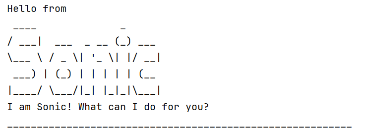

# Sonic User Guide



Sonic is a task management Command Line Interface application that helps the user organize tasks, whether it's a to-do task, a deadline, or an event.

## Table of Contents

## Getting Started

  1. Ensure you have Java 17 or above installed on your computer.
  2. Download the latest .jar from here.
  3. Copy the file to the folder you want to use as the home folder for your TaskList.
  4. Open a command terminal, cd into the folder you put the jar file in and run the following:
`java -jar sonic.jar`

## Features

### Adding a todo tasks

### Adding a deadline

### Adding an event 

### Marking tasks

### Unmarking tasks

### Listing all tasks

### Deleting a task

### Findng tasks


## Command Summary

## Date and Time Formats

The user can use these date and time formats for deadline and event features:

- `2019-03-22` is converted to `Mar 22 2019`
- `2200` is converted to `10pm`
- `2019-03-22 2200` is converted to `Mar 22 2019 10pm`
- `2200 2019-03-22` is converted to `10pm Mar 22 2019`

## File Storage

Sonic stores tasks in a file named sonic.txt at ip/data/sonic.txt.

The tasks are saved in the sonic.txt in the below format:

`D | 0 | submit assignment | Mar 22 2019`<br>
`T | 1 | Read textbook`<br>
`E | 0 | do the user guide | 6pm | not sure`


When the user launches Sonic, it automatically loads the tasks from sonic.txt into the task list. 
Any changes made to the task list are instantly saved, ensuring the tasks remain accessible even after restarting the application.

// Describe the action and its outcome.

// Give examples of usage

Example: `keyword (optional arguments)`

// A description of the expected outcome goes here

```
expected output
```

## Feature ABC

// Feature details


## Feature XYZ

// Feature details